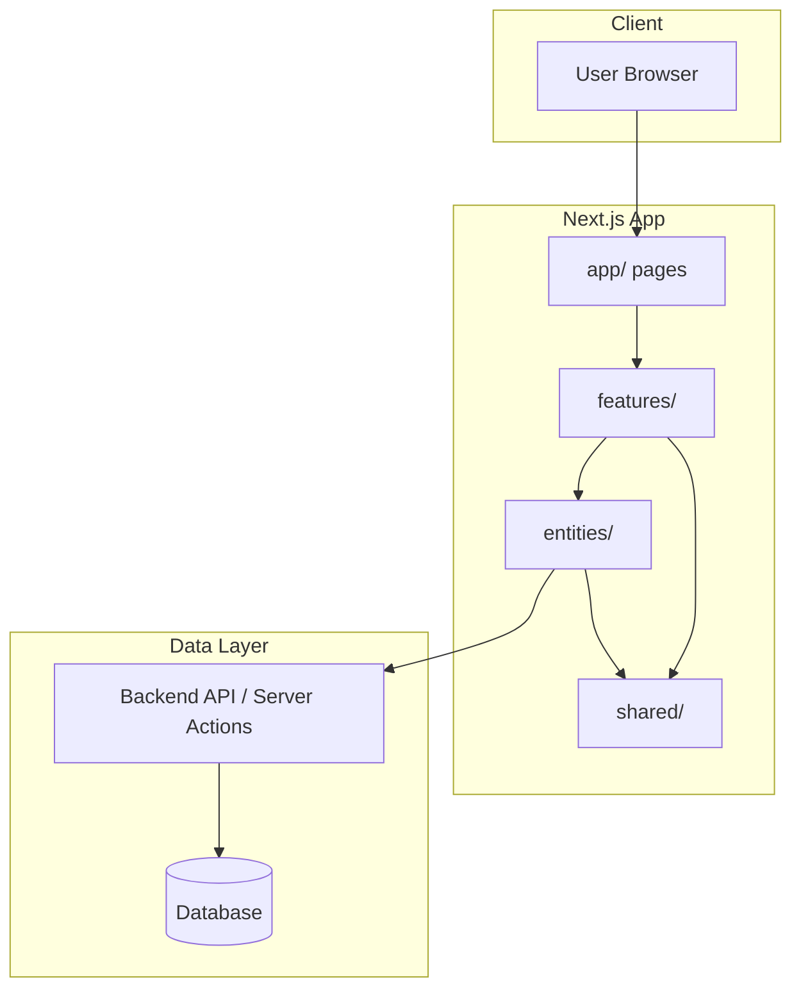
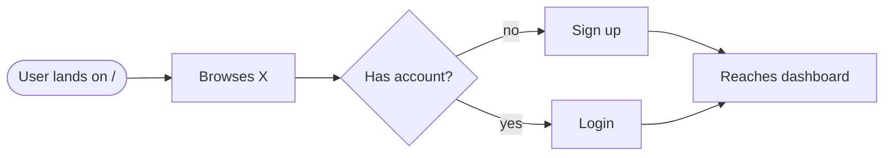
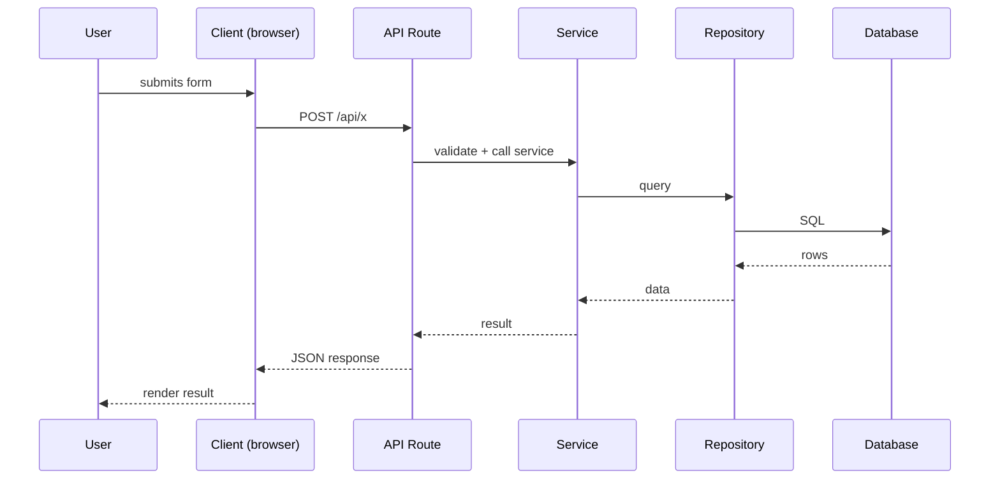

# Flow — Function Call Map & User Flows

> **Purpose**: The "how it works" file. It maps which functions call what, the user
> journeys, request/response sequences, and routes. Reading this file gives you an
> instant mental model of the project structure.
>
> **Update rule (MANDATORY)**: Update this file whenever you add, rename, or remove any
> function, component, hook, route, API endpoint, or user flow. Never let it go stale —
> agents and humans navigate the codebase through this file.

---

## Overview

[2–3 sentences: what the app does, the main loop, the key actors.]

---

## Architecture Diagram



---

## User Flows

> Each flow = one user journey. Format: goal → steps → outcome.

### Flow: [User flow name]
**Goal**: [what the user wants]
**Steps**: [brief description]



---

## Request / Response Flows

> One sequence diagram per key request. Use the Client → Route → Service → Repository →
> Database chain that matches the actual code.

### [Flow name]


---

## Function Call Map

> Which function calls what, per feature. Keep this accurate — agents use it to navigate
> the code and find where changes are needed.

### Feature: [feature name]
```
app/page.tsx (route composition)
  └─ <FeatureComponent />        (features/<feature>/components/)
       └─ use<Feature>Hook()     (features/<feature>/hooks/)
            └─ <feature>Service() (features/<feature>/service/)
                 └─ apiClient.get("/api/...")
```

### Feature: [feature name]
- `[Function A]` calls `[Function B]` to [why]
- `[Function B]` calls `[Repository X]` to [why]

---

## Route Map

| Route | Page / Handler | Purpose | Auth Required |
|-------|----------------|---------|---------------|
| `/` | `app/page.tsx` | Landing page | No |
| `/login` | `app/(auth)/login/page.tsx` | Sign in | No |

---

## API Endpoints

| Method | Path | Handler | Purpose |
|--------|------|---------|---------|
| POST | `/api/auth/login` | `authService.login` | Sign in and issue session |

---

## State Flow

> How state moves through the app (server → client → store). Describe the data flow,
> not just the components.

1. Server component fetches data in `app/` and passes props down
2. Client components call `<feature>Controller` for mutations
3. `queryClient` caches/invalidates on mutations

---

## Tooling / Bootstrap Flow (2026-09-24 — no app code touched)

> Skills + Spec Kit setup. No Flutter `lib/`, routes, or APIs changed.

```
python Skills.py --yes
  ├─ check npm/npx (11.19.1)
  ├─ npm init -y → package.json (node sidecar in Flutter repo)
  └─ parallel npx installs → .agents/skills/ (36 dirs)
       ├─ 8× gsap-* (greensock/gsap-skills)
       ├─ 1× hallmark (nutlope/hallmark)
       ├─ 13× taste variants (Leonxlnx/taste-skill)
       ├─ 13× emilkowalski/skills
       └─ 1× impeccable engine (v0.1.5 windows-x64)

specify init . --integration opencode --force --non-interactive --script ps
  ├─ .specify/ (templates, scripts/ps, memory/constitution.md)
  ├─ .opencode/ + .codex/ (agent integrations)
  └─ unlocks /speckit.constitution → /speckit.specify → /speckit.plan → /speckit.tasks → /speckit.implement
```

- App flows/routes/APIs: unchanged (Flutter `lib/` untouched; this file's placeholders still apply to template, not the shop app — to be filled per project).
- Next: `/speckit.constitution` (constitution.md still placeholders).

---

## Water App — Actual (Flutter, Phase 1, 2026-09-24)

> NOTE: The Next.js diagrams above are template placeholders. The real app is
> Flutter (`shop` package). This section is the source of truth until the
> placeholders are replaced.

### Bottom nav (`lib/entry_point.dart`)
```
EntryPoint [_currentIndex]
  ├─ 0 Home    → HomeScreen
  ├─ 1 Orders  → OrdersScreen (ONGOING / PAST tabs)
  ├─ 2 Shop    → DiscoverScreen (water categories)
  └─ 3 Account → ProfileScreen (Phase 1: as-is)
```

### Screen → data flow (all reads go through repositories)
```
HomeScreen
  ├─ DeliveryAddressHeader      → defaultAddress (order_model)
  ├─ SearchForm                 → searchScreenRoute
  ├─ Categories (chips)         → local list (no route)
  ├─ WaterProducts (qty state)  → ProductRepository.all()
  │    └─ ProductCard(stepper)  → productDetailsScreenRoute(product.id)
  ├─ OrderAgain                 → OrderRepository.lastOrder() → cart + Reorder
  └─ ActiveDelivery             → SubscriptionRepository.activeDelivery()

ProductDetailsScreen(productId)
  └─ ProductRepository.byId() → spec table/qty → orderTypeScreenRoute{productId, qty}

OrderTypeScreen → one-time → cartScreenRoute{…orderType}
                → regular  → subscriptionConfigScreenRoute{…} → cart (regular)

CartScreen (checkout) → OrderRepository.placeOrder() → success → orders / home
OrdersScreen → OrderRepository → View sheet → OrderProgress
SubscriptionsScreen → SubscriptionRepository → pause/skip/modify (local state)
SearchScreen → ProductRepository.search() → details
```

### Route map (new/changed)
| Route | Screen | Notes |
|-------|--------|-------|
| `entry_point` | `EntryPoint` (4 tabs) | Bookmark/Cart tabs removed |
| `product_details` + id arg | `ProductDetailsScreen` | bool-arg fallback kept |
| `cart` (+ optional Order arg) | `CartScreen` | reorder seeding via args |
| `orders` | `OrdersScreen` | repo-backed tabs |

---

## CI Pipeline (GitHub Actions, 2026-09-24)

```
push(main, feature/**) / PR→main / dispatch
  ├─ analyze ────────► checkout → java17 → flutter 3.44.9 → pub get → analyze
  ├─ test ───────────► checkout → java17 → flutter 3.44.9 → pub get → flutter test
  └─ build-android ──► checkout → java17 → setup-gradle → flutter → pub get
                       → apk --debug → appbundle --release → upload APK + AAB
(all parallel; concurrency cancels superseded runs; PR Gradle cache read-only)
```
- Repo: `github.com/aditya452007/water-delivery-app` (private). Branch pushed.
- Status: runs `startup_failure` in 0s account-wide (proven via probe repo) —
  pipeline code verified locally, awaiting GitHub-side unblock.
- 2026-09-24 update: email verified, billing ruled out per docs (Free quota
  untouched, no card → cannot be charged). Next: user files support ticket.
- Release flow: `git tag vX.Y.Z(-suffix) && git push origin tag` → Release job
  (fresh build → optional keystore sign → versioned APK/AAB/SHA256 → Release page).
  First release `v1.0.0-phase1` live with installable APK.

---

## Update Protocol (MANDATORY)

Update this file when any of the following change:

- [ ] New, renamed, or removed function / component / hook / route
- [ ] Call chain between functions changed
- [ ] New user flow or a change to an existing flow
- [ ] New or removed API endpoint
- [ ] New dependency in a call chain (library, service)
- [ ] State management approach changed

When you update, keep the diagrams in sync with the code — a stale diagram is worse than no diagram.
